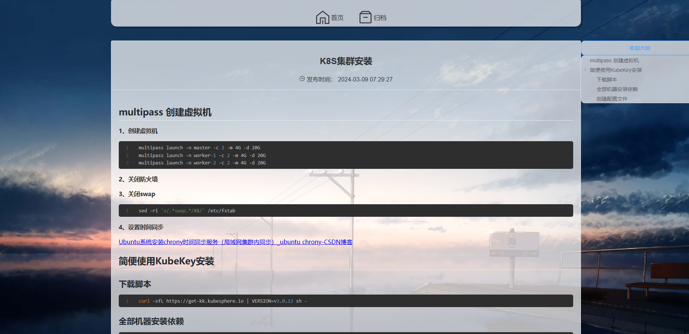

### Blog
个人博客 \
前端为Vue3 + pinia
后端为Springboot+Mysql+shiro+redis

前端页面仿造[hexo-theme-volantis](https://volantis.js.org)编写

前端结构：
│  App.vue \
│  main.ts\
│  registerServiceWorker.ts\
│  shims-vue.d.ts\
│\
├─api\
│      api.js \
│\
├─assets\
│      logo.png\
│\
├─components\
│      Account.vue 后台管理\
│      ArticleList.vue 首页文章列表\
│      Author.vue 作者卡片\
│      BackGround.vue 背景图\
│      Classify.vue 分类卡片\
│      CreateArticle.vue 编写文章\
│      Footer.vue 页脚\
│      Header.vue 首部导航\
│      ManageArticle.vue 文章管理\
│      UpdateArticle.vue  更新文章\
│
├─router
│      index.ts\
│
├─store
│      article.ts\
│      auth.ts token\
│      config.ts 缓存信息、背景图URL\
│      store.ts\
│\
├─utils\
│      utils.js\
│\
└─views\
├─Admin\
│      UserCenter.vue 后台页面\
│\
├─Article\
│      Archiving.vue 归档页面\
│      Read.vue 阅读页面\
│\
├─Error\
│      404.vue 404\
│\
└─Home 主页页面\

后端请参考Swagger文档

部分页面截图

